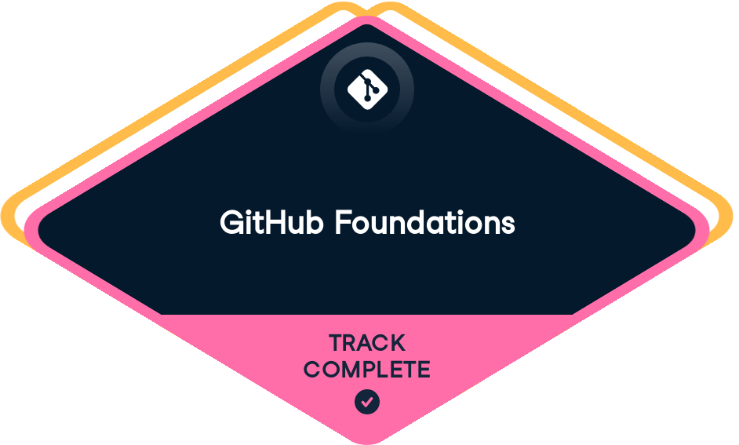

  

  
  

---

### 👋 About me

**Testing Engineer** at the Legislature of Tucumán (since 2024). I'm the QA for the organization's web systems, from legislative case management to asset inventory, and I build the tooling that makes testing faster. University Technician in Programming from **UTN – FRT**, so I write code too and understand what breaks and why.

- 🌎 Languages: Spanish (native) · English (bilingual)
- 🌱 Learning: performance testing (JMeter) and cybersecurity

### 🧪 What I do

| Area | Details |
|---|---|
| **Functional QA** | Black-box, regression and exploratory testing across multiple internal web systems |
| **E2E automation** | Cypress suites organized by system, split into core flows and feature specs |
| **Bug reporting** | Structured issues: description, actual vs. expected behavior, steps to reproduce |
| **Test documentation** | Test case sheets per card and role-based user manuals with automated screenshots |
| **Process** | GitHub Projects flow: *Ready to test → In testing → Done / In Review* |

### 🚀 What I'm building

**🧰 Cypress reporting platform**: an end-to-end pipeline for test results.
- **Runner**: executes Cypress suites and classifies results per system and test type
- **Backend** (Node.js · Express · MySQL): ingests and stores versioned reports through a REST API
- **Dashboard** (React): browse executions, separate known bugs from real failures and draft a GitHub bug issue in one click, with sensitive data redacted automatically

**🤖 AI-assisted QA**: [claude-qa-card](https://github.com/lucasfernandez789/claude-qa-card), a Claude Code plugin that takes a GitHub card, moves it through the project board, tests it and generates the test case sheet.

**📘 Docs as code**: user manuals written in Markdown, with screenshots captured by browser automation and exported to Word through a pandoc pipeline.

### 🛠️ Toolbox

   
   
  

  
  
  

### 🎓 Education & certifications

  
  
  
  

- **University Technician in Programming** · UTN – Facultad Regional Tucumán (2019–2023)
- [Software Testing from Scratch: MasterClass](https://www.udemy.com/certificate/UC-4f2d4fd8-7949-4c00-80af-12ec07101391/) · Udemy (2025)
- [GitHub Foundations](https://www.datacamp.com/completed/statement-of-accomplishment/track/a4c0593e23c328bfa59f38824fff6451926bd50e) track · DataCamp
- Foundations of Cybersecurity
- Play It Safe: Manage Security Risks

